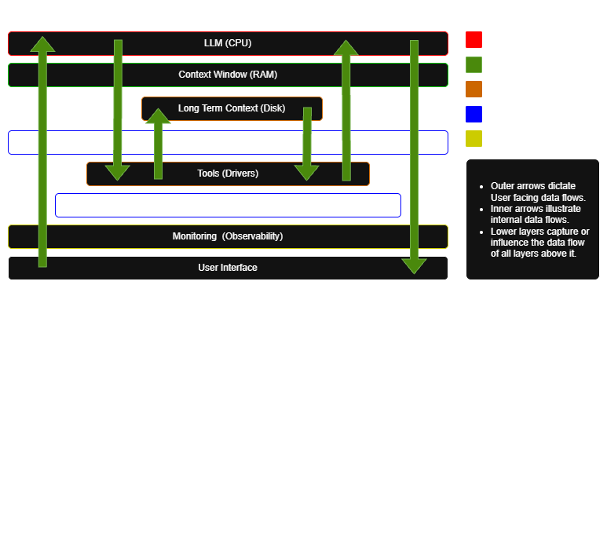

# Baseline Agentic Workflow

This agent is a demo that explores concepts in agentic AI workflow design and construction.

Key features:
- Context Management
  - Long term memory via DB
- Prompt and Response Guardrails
  - Prompt injection detection models
  - NSFW detection models
- LLM performance configuration
  - vLLM (Chunked prefill, paged attention, continuous batching)

### Agentic Structure Concept
The design concept of the baseline agent structure contains five fundamental 
layers.
- `Orchestration Layer`: Manages goal decomposition and coordinates the logical flow of tasks between agents.
- `Memory Layer`: Stores short-term context and long-term knowledge to ensure consistency across interactions.
- `Augmentation Layer`: Provides external tools and API connections that allow agents to execute real-world actions.
- `Policy & Enforcement Layer`: Hard-codes technical guardrails and security rules to prevent unauthorized or unsafe behaviors.
- `Observation Layer`: Logs every action and decision to provide the transparency needed for auditing and debugging.

### Demo Agent
